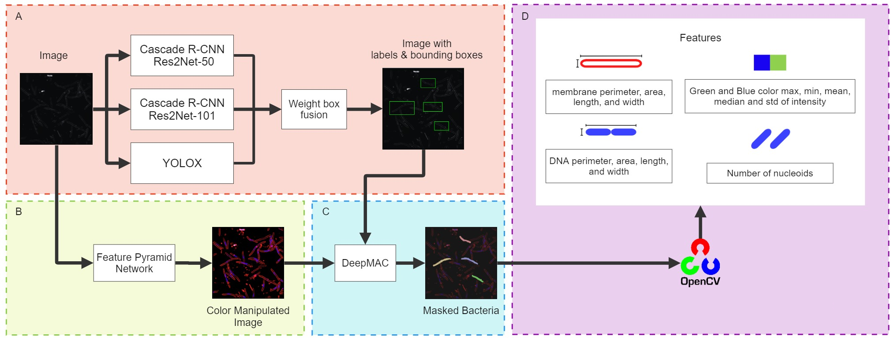
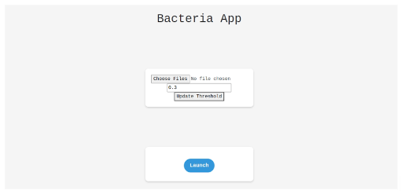
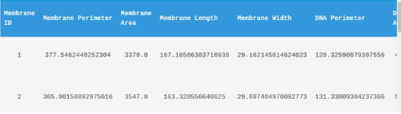

# Deep Learning-Based Object Detection and Bacteria Morphological Feature Extraction for Antimicrobial Resistance Applications

Antibiotics are the primary drug for treating various kinds of infections occurring from bacteria and microbes.
They work mainly by blocking the vital pathway of those organisms and stopping them from multiplying. Previous
research shows that we can predict the antibiotics used on bacteria by visualizing their morphology. Here,
we present object detection for detecting bacteria and identifying the antibiotics used on them with their mophological
features for example DNA intensity, contour area, and min areaRect.

There are 8 common classes we are interested including E.Coli bacteria treated with **Ampicillin**, **Ciprofloxacin**, **Rifampicin**,
**Tetracycline**, **Mecillinam**, **Kanamycin**, **Colistin**, and **Untreated**.



## Object detection

The current results of single models and ensemble models are as follows.


| Model                    | Backbone             | Head | Neck           | mAP   | mIOU  | AP(50) | AP(75) | AP (medium) | AP (large) | Config| Checkpoint| 
|:---:|:---:|:---:|:---:|:---:|:---:|:---:|:---:|:---:|:---:|:---:|:---:|
| YOLOv2              | Darknet-19  |  |   | 0.053 | 0.192 | 0.015  | 0.048  | 0.102       | 0.140      | [config](web-app/backend/yolov2_config)| [ckpt](https://drive.google.com/file/d/1Tm3xWxKgweq94iSd2b0Zl3Gpu9vxX1Dv/view?usp=sharing)|
| Faster R-CNN             | ResNet-50  | | | 0.041 | 0.097 | 0.031  | 0.005  | 0.045       | 0.325      | [config](https://drive.google.com/file/d/1cZlr8xFpUF4yewmXtlNVz6fdCepzM2n1/view?usp=sharing)| [ckpt](https://drive.google.com/file/d/1pXOvyey2I5_r2dXaTC-Cx0Kd2LHt8sC3/view?usp=drive_link)|
| Cascade R-CNN             | Res2Net-101 + DcnV2  | SABL | PAFPN + DyHead | 0.652 | 0.800 | 0.808  | 0.762  | 0.677       | 0.692      | [config](web-app/backend/mmdetection/configs/bacteria_r2_101dcn_dyhead.py)| [ckpt](https://drive.google.com/file/d/15cg_AlEWRoOmPVp9NZh-VrgWe-SZq_8a/view?usp=sharing)|
| YOLOX-M                  | CSPDarknet | -    | PAFPN          | 0.621 | 0.755 | 0.902  | 0.835  | 0.711       | 0.796      | [config](web-app/backend/mmdetection/configs/bacteria_yolox_m_8x8_300e_coco.py)| [ckpt](https://drive.google.com/file/d/1gw203zflhT_YrlB67rCT4O7hIh1N6njo/view?usp=sharing)|[config](web-app/backend/mmdetection/configs/bacteria_yolox_m_8x8_300e_coco.py)|
| Cascade R-CNN             | Res2Net-50 + DcnV2   | SABL | DyHead         | 0.680 | 0.802 | 0.820  | 0.779  | 0.704       | 0.628      | [config](web-app/backend/mmdetection/configs/bacteria_r2_50dcn_dyhead.py)| [ckpt](https://drive.google.com/file/d/1PMbpZXUvjLWMXvpYIGzoiBLNzCPPN8jb/view?usp=sharing)|
| Ensemble Model |    |  |  | 0.753 | 0.699 | 0.863   | 0.796  | 0.717       | 0.675      |  |  |


## Bacteria Feature Extraction

We apply the following approach to extract bacteria features:

- **Feature Pyramid Network (FPN)** for automatic color manipulation
- **Deep MAC** for instance segmentation from the bounding box given by object detection models
- **Open-CV** for feature extraction. We extract 19 morphological features using
  OpenCV to obtain cell parameters such as area, perimeter, and dimensions of the segmented regions

We compare downstream antibiotic classification with SVM using features extracted from our model and CellProfiler.

|               | Bacteria detection model | CellProfiler |
|:---------------:|:---------------:|:---------------:|
| Mean F1-score | 0.76                     | 0.796        |

This difference is considered acceptable because the number of bacteria that the CellProfiler can detect is significantly lower than the model’s but higher in terms of quality since the CellProfiler can only detect complete bacteria cells.

## Dataset

The current dataset contains **900 images**: Ampicillin (100), Ciprofloxacin (100), Rifampicin (100), Tetracycline (100), Mecillinam(100), Kanamycin(100), Colistin(100), and Untreated (200). We annotated the RGB version in PNG format of the bacteria images which is easier to visualize using [labelme](https://github.com/wkentaro/labelme). Images are in TIFF format that we use for actual model training and testing.

<table style="padding:10px">
  <tr>
    <td style="text-align:center"> High intensity image </td>
    <td style="text-align:center"> Low intensity image </td>
  <tr>
    <td> 
         
    </td>
      
  <td>
         
  </td>
    
   <!--<td></td>-->
  </tr>
</table>


## Installation 

### Download and activate the environment
- Download the virtual environment from [here](https://drive.google.com/file/d/1EwfR__0LvSdsA8pa6B21qJLy-YM7r81A/view?usp=sharing)
- Move the virtual environment to the bacteria-detection folder
- extract the virtual environment

``` sh
cd bacteria-detection
conda activate ./path/to/virtual_environment
```

### Download Pre-trained Weight

We release the pre-trained model weight for reproducibility purposes. You can download the weights of all models by DVC

``` sh
dvc pull
```

### Back-end: FastAPI

```
$ cd webapp/backend
$ uvicorn app:app --reload
```

### Front-end: ReactJS

Install NodeJS [here](https://nodejs.org/en)
```
$ cd webapp/frontend/bacteria-app
$ npm start
```

### Web application

<table style="padding:10px">
  <tr>
    Upload a bacteria file(s)
    
  <tr>
    Perform prediction: bbox with class (left) and bbox with an index number for feature extraction table (right)
    
    Table of Feature Extraction results
    
</table>

## Inference without web-app
```
$ cd webapp/backend/inverence
$ python inference_ensemble.py --imgs_folder <Path/to/Image/Folder>
```
The outputs will be in the output folder and include
1. CSV file of all detection results
2. CSV file of all extracted features

### Training 
YOLOv2 model is trained using [darknet](https://github.com/pjreddie/darknet)\
Other object detection models are trained using [mmdetection](https://github.com/open-mmlab/mmdetection)


## Members

- Korrawiz Chotayapa
- Thanyatorn Leethamchayo
- Piraya Chinnawong
- Titipat Achakulvisut

## ACKNOWLEDGMENT
We would like to thank Poochit Nonejuie Ph.D. and Mr. Thanadon Samernate from the Institute of Molecular Biosciences that inspired us and prepared the dataset for this study.
